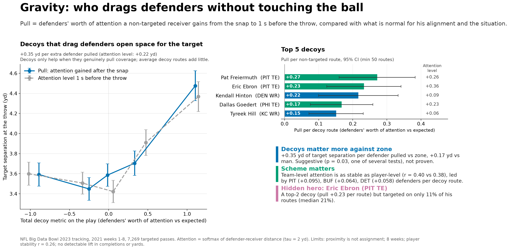

# Gravity: decoys that drag defenders open space for the target



**Every extra defender pulled buys +0.35 yd of separation, about twice as much against zone as man.**

Gravity credits the receivers the box score ignores, the non-targeted WRs, TEs and RBs who pull defenders away from the target, and is inspired by the [NBA](https://www.nba.com/news/intro-to-gravity-stat-nba-2025)/[WNBA](https://www.wnba.com/news/intro-to-gravity-stat-wnba-2026) Gravity stat and [ESPN's receiver double-team adjustment](https://www.espn.com/nfl/story/_/id/34649390/espn-receiver-tracking-metrics-how-new-nfl-stats-work-open-catch-yac-scores). Each coverage defender spreads one unit of attention over the route runners with a softmax on distance (tau = 2 yd); our contribution is **pull** (attention gained after the snap, compared with what a context-aware model expects from alignment, formation, coverage and game situation), a 1 s-before-throw test that avoids double counting, and the zone vs man difference. Every extra defender pulled buys the target +0.35 yd of separation at the throw (95% CI 0.26–0.44), about twice as much against zone (+0.35 yd) as man (+0.17 yd; suggestive, p = 0.03, one of several tests), and decoys only help when they genuinely pull coverage; average decoy routes add little. Pittsburgh's tight ends lead the league, Pat Freiermuth (+0.27 defenders per decoy route) and Eric Ebron (+0.23, a top-2 decoy targeted on only 11% of his routes), with Tyreek Hill #5. For a coach, this shows who to scheme as the decoy to open the primary read, especially against zone, and scheme matters as much as the player: team-level attention is as stable as player-level (r = 0.40 vs 0.38), led by PIT.

**Limitations:** 8 weeks of data; proximity ≠ assignment (a defender near a receiver is not necessarily covering him); moderate player stability (split-half r = 0.26); no detectable lift in completions or yards yet. Targets are parsed from the play description (96.1% match rate), and tracking ends 0.5 s after the throw, so there is no pass-arrival frame.

## How to run

```bash
pip install -r requirements.txt
python main.py   # about 2 minutes; the first run caches the tracking CSVs in cache/
```

Expects the NFL Big Data Bowl 2023 files in `data/` (`games.csv`, `plays.csv`, `players.csv`, `pffScoutingData.csv`, `tracking/*.csv`); see `data/README.md`. Sample: 2021 weeks 1–8, 7,269 targeted passes from 122 games.

## Outputs (`outputs/`)

| File | What it shows |
|---|---|
| `summary.png` | One-page summary |
| `leaderboard.png`, `leaderboard.csv` | Decoys ranked by pull (min 50 non-targeted routes), with attention level, targets per route and separation when targeted |
| `decoy_pull_vs_separation.png`, `binned_separation.csv` | Target separation at the throw by quintile of total decoy pull, with 95% CIs |
| `play_example.png`, `play_example.gif` | Tyreek Hill dragging the defense (KC vs BAL, 2021 week 2) |
| `effects.csv` | Regressions of separation, completion and yards on each decoy metric (game-clustered SEs) |
| `coverage_split.csv` | Man vs zone, with the interaction test |
| `metric_comparison.csv` | Pull vs attention level: effect, stability, link to own separation, star-WR ranks |
| `team_leaderboard.csv` | Attention level per decoy route for each offense |
| `stability.csv` | Split-half stability for players and teams (weeks 1–4 vs 5–8, odd vs even weeks) |
| `hidden_heroes.csv` | Top-15 decoys who are bottom half for targets per route |
| `tau_sensitivity.csv` | Top-10 overlap for tau = 1.5 and 3 yd vs 2 yd |
| `data_summary.csv` | Plays, games, weeks and target match rate |
| `step2_one_play_check.png` | Early sanity check of the attention weights on one play (not regenerated by `main.py`) |

## Code

- `main.py`: end-to-end pipeline; writes every number above to `outputs/*.csv`
- `src/clean.py`: load, flip plays left to right, join, key frames, target parsing
- `src/metric.py`: softmax attention, gravity, separation
- `src/model.py`: expected gravity (gradient boosting, out-of-fold by game)
- `src/analysis.py`: play, player and team tests
- `src/plots.py`: figures (Okabe-Ito colour-blind-safe palette)
